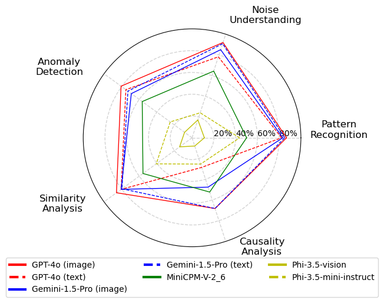
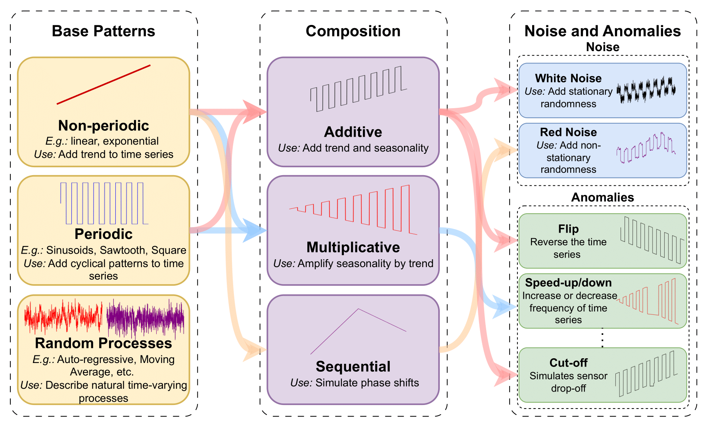

<div align="center">

<h1>TimeSeriesExam: A Time Series Understanding Exam</h1>

[](https://arxiv.org/abs/2410.14752)
[](https://huggingface.co/datasets/AutonLab/TimeSeriesExam1)
[](https://opensource.org/license/MIT)
[]()

</div>

## 🔥 News 
- 🔥🔥 (Oct'24) `TimeSeriesExam` was accepted to to the NeurIPS'24 Workshop on [Foundation Models for Time Series: Exploring New Frontiers](https://sites.google.com/corp/view/fm4ts/home), and ICAIF'24 Workshop on [Time Series in the Age of Large Models](https://neurips-time-series-workshop.github.io/) as a spotlight papers!

</div>

## 📖Introduction
Large Language Models (LLMs) have recently demonstrated a remarkable ability to model time series data. These capabilities can be partly explained if LLMs understand basic time series concepts. However, our knowledge of what these models understand about time series data remains relatively limited. To address this gap, we introduce TimeSeriesExam, a configurable and scalable multiple-choice question exam designed to assess LLMs across five core time series understanding categories: pattern recognition, noise understanding, similarity analysis, anomaly detection, and causality analysis.

<div align="center">


Figure. 1: Accuracy of latest LLMs on the `TimeSeriesExam.` Closed-source LLMs outperform open-source ones in simple understanding tasks, but most models struggle with complex reasoning tasks.

</div>

Time series in the dataset are created from a combination of diverse baseline Time series objects. The baseline objects cover linear/non-linear signals and cyclic patterns. 

<div align="center">


Figure. 2: The pipeline enables diversity by combining different components to create numerous synthetic time series with varying properties.

</div>

## 🧑‍💻 Running Exam Generation

#### Step 1: Install Envrionment and Library
This step ensures you have the necessary tools and libraries to run the evaluation scripts. 

These commands create a new conda environment named ts_exam with Python 3.12.0, activate the newly created environment, and install the required libraries listed in the `requirements.txt` file using pip:

```bash
> conda create -n "ts_exam" python=3.12.0
> conda activate ts_exam
> pip install -r requirements.txt
```

#### Step 2: Set up generation config
There are several hyper-parameters for exam generation 
- **`num_questions_per_option`**: number of qa samples to create from each option
- **`ts_length`**: length of generated time series
- **`output_file`**: path to the generated file

We provide an example script to generate the exam 

```bash
> sh run.sh
```

</div>

## 🧑‍🏫 File structure

We provide description for important components in the generation pipeline to faciliate future research. 

#### Baseline Time Series Objects
-  **`time series objects`**: All the baseline objects are stored under `timeseries_curation/timeseries_object.py`. Each of them has a `generate` method that samples from the object given length. 
-  **`transformations`**: transformations are appleid on a generated time series. They are stored under `timeseries_curation/transformation.py`
-  **`composition modules`**: composition modules combine multiple time series objects together. They are stored under `timeseries_curation/composer.py`. Each of them has a `generate` method that samples from the object given length. 

#### Question Templates

We add a short description of important elements in the template below 
- **`question`**: The template’s main question (string).  
- **`options`**: A list of `Option` objects defining the corresponding time series to generate.  
- **`relevant_concepts`**: Related concepts, which must exist in the `CONCEPT` dictionary.  
- **`question_hint`**: A hint to guide the approach to the question. 

#### Options

There are three main types of options that TimeSeriesExam uses. Their definition are stored in `utils/utils.py`

- **`single time series option`**: used to generate a single time series
- **`two time series option`**: used to generate a pair of config-independent time series
- **`paired time series option`**: used to generate a pair of config-dependent time series (such as lagged or granger pairs)

#### Generation

Generation is done under `main.py`. Each template is sampled pre-defined number of times to generate the actual dataset. 

</div>

## Adding Your Own Template

To add a template to TimeSeriesExam, please consider the following steps

### Step 1: Define new baseline objects (Optional)
- Open corresponding object file under `timeseries_curation/`. For example, to add a new composition module, add it under `timeseries_curation/composer.py`

### Step 2: Add template 
- Go to the file `question_template.py`.
- Import the new time series object (if added in Step 1)
- Create your template following the previous example. 
  
</div>

## Citation

If you find this work helpful, please consider citing our paper:

```bibtex
@inproceedings{caitimeseriesexam,
  title={TimeSeriesExam: A Time Series Understanding Exam},
  author={Cai, Yifu and Choudhry, Arjun and Goswami, Mononito and Dubrawski, Artur},
  booktitle={NeurIPS Workshop on Time Series in the Age of Large Models}
}
```

</div>

## 🪪 License

MIT License

Copyright (c) 2024 Auton Lab, Carnegie Mellon University

Permission is hereby granted, free of charge, to any person obtaining a copy of this software and associated documentation files (the "Software"), to deal in the Software without restriction, including without limitation the rights to use, copy, modify, merge, publish, distribute, sublicense, and/or sell copies of the Software, and to permit persons to whom the Software is furnished to do so, subject to the following conditions:

The above copyright notice and this permission notice shall be included in all copies or substantial portions of the Software.

THE SOFTWARE IS PROVIDED "AS IS", WITHOUT WARRANTY OF ANY KIND, EXPRESS OR IMPLIED, INCLUDING BUT NOT LIMITED TO THE WARRANTIES OF MERCHANTABILITY, FITNESS FOR A PARTICULAR PURPOSE AND NONINFRINGEMENT. IN NO EVENT SHALL THE AUTHORS OR COPYRIGHT HOLDERS BE LIABLE FOR ANY CLAIM, DAMAGES OR OTHER LIABILITY, WHETHER IN AN ACTION OF CONTRACT, TORT OR OTHERWISE, ARISING FROM, OUT OF OR IN CONNECTION WITH THE SOFTWARE OR THE USE OR OTHER DEALINGS IN THE SOFTWARE.

See [MIT LICENSE](LICENSE) for details.


