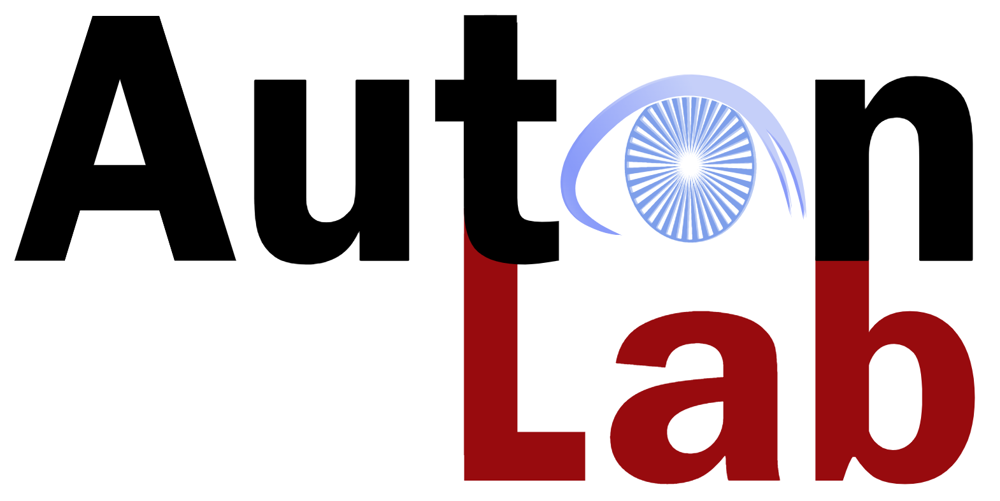

<h1>TimeSeriesExam: A Time Series Understanding Exam</h1>

</div>

## News 
- TimeSeriesExam was accepted to NeurIPS'24 Time Series in the Age of Large Models Workshop as a spotlight paper!

</div>

## Introduction
Large Language Models (LLMs) have recently demonstrated a remarkable ability to model time series data. These capabilities can be partly explained if LLMs understand basic time series concepts. However, our knowledge of what these models understand about time series data remains relatively limited. To address this gap, we introduce TimeSeriesExam, a configurable and scalable multiple-choice question exam designed to assess LLMs across five core time series understanding categories: pattern recognition, noise understanding, similarity analysis, anomaly detection, and causality analysis.


</div>

## Running evaluation

Step 1: Install Envrionment and Library
```python
conda create -n "ts_exam" python=3.12.0
conda activate ts_exam
pip install -r requirements.txt
```

Step 2: (Required for closed-source model): Add your api key to environment
It would be the best practice to follow guidance [here](https://help.openai.com/en/articles/5112595-best-practices-for-api-key-safety)

Step 3:
There are two evaluation bash scripts provided. To evaluate the dataset, run the corresponding
```python
sh evaluate/evaluate_file_name.sh
```

</div>

## Evaluation Config
- data_file_path: path to .json file for qa dataset
- model_name: Current support list of model are
    - "gpt-4o-mini"
    - "gpt-4o"
    - "claude-3-5-sonnet-20240620"
    - "gemini-1.5-pro"
    - "openbmb/MiniCPM-V-2_6"
    - "microsoft/Phi-3.5-vision-instruct"
    - "microsoft/Phi-3.5-mini-instruct"
- seed: random seed
- max_tokens: max new tokens for generation
- temperature
- output_file_path: path to save the .json file to record result
- image_cache_dir: needed only for image models, as images are plotted and saved during inference
- ts_tokenizer_name: choose from 'image' or 'plain_text'
- add_question_hint: a flag if added, feeds a question hint to model
- add_concepts: a flag if added, feeds a list of relevant concepts to model
- add_examples: a flag if added, feeds example time series illustrated in concepts to model (need to have add_concepts enabled for this)

</div>

## Adding your own model

Step 1: Register its information in bolded global variable add 
```
evaluate/llm_api.py
```

Step 2: Define the query and format function like already defined ones in 

```
evaluate/evaluation_utils.py
```

</div>

## Citation

If you find this work helpful, please consider citing our paper:

```bibtex
@article{cai2024timeseriesexam,
  title={TimeSeriesExam: A time series understanding exam},
  author={Cai, Yifu and Choudhry, Arjun and Goswami, Mononito and Dubrawski, Artur},
  journal={arXiv preprint arXiv:2410.14752},
  year={2024}
}
```

</div>

## 🪪 License

MIT License

Copyright (c) 2024 Auton Lab, Carnegie Mellon University

Permission is hereby granted, free of charge, to any person obtaining a copy of this software and associated documentation files (the "Software"), to deal in the Software without restriction, including without limitation the rights to use, copy, modify, merge, publish, distribute, sublicense, and/or sell copies of the Software, and to permit persons to whom the Software is furnished to do so, subject to the following conditions:

The above copyright notice and this permission notice shall be included in all copies or substantial portions of the Software.

THE SOFTWARE IS PROVIDED "AS IS", WITHOUT WARRANTY OF ANY KIND, EXPRESS OR IMPLIED, INCLUDING BUT NOT LIMITED TO THE WARRANTIES OF MERCHANTABILITY, FITNESS FOR A PARTICULAR PURPOSE AND NONINFRINGEMENT. IN NO EVENT SHALL THE AUTHORS OR COPYRIGHT HOLDERS BE LIABLE FOR ANY CLAIM, DAMAGES OR OTHER LIABILITY, WHETHER IN AN ACTION OF CONTRACT, TORT OR OTHERWISE, ARISING FROM, OUT OF OR IN CONNECTION WITH THE SOFTWARE OR THE USE OR OTHER DEALINGS IN THE SOFTWARE.

See [MIT LICENSE](LICENSE) for details.



