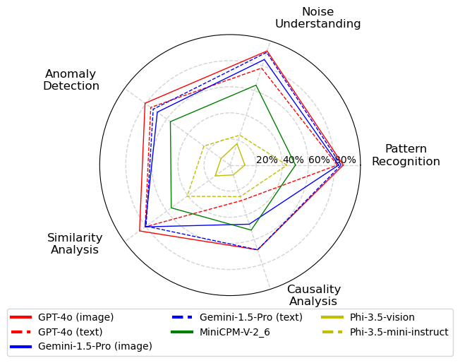

<div align="center">

<h1>TimeSeriesExam: A Time Series Understanding Exam</h1>

[](https://arxiv.org/abs/2410.14752)
[](https://huggingface.co/datasets/AutonLab/TimeSeriesExam1)
[](https://opensource.org/license/MIT)
[]()

</div>

## 🔥 News 
- 🔥🔥 (Oct'24) `TimeSeriesExam` was accepted to to the NeurIPS'24 Workshop on [Foundation Models for Time Series: Exploring New Frontiers](https://sites.google.com/corp/view/fm4ts/home), and ICAIF'24 Workshop on [Time Series in the Age of Large Models](https://neurips-time-series-workshop.github.io/) as a spotlight papers!

</div>

## 📖Introduction
Large Language Models (LLMs) have recently demonstrated a remarkable ability to model time series data. These capabilities can be partly explained if LLMs understand basic time series concepts. However, our knowledge of what these models understand about time series data remains relatively limited. To address this gap, we introduce TimeSeriesExam, a configurable and scalable multiple-choice question exam designed to assess LLMs across five core time series understanding categories: pattern recognition, noise understanding, similarity analysis, anomaly detection, and causality analysis.

<div align="center">


Figure. 1: Accuracy of latest LLMs on the `TimeSeriesExam.` Closed-source LLMs outperform open-source ones in simple understanding tasks, but most models struggle with complex reasoning tasks.

Time series in the dataset are created from a combination of diverse baseline Time series objects. The baseline objects cover linear/non-linear signals and cyclic patterns. 

<div align="center">


Figure. 2: The pipeline enables diversity by combining different components to create numerous synthetic time series with varying properties.

</div>

</div>

## 🧑‍💻 Running evaluation

#### Step 1: Install Envrionment and Library
This step ensures you have the necessary tools and libraries to run the evaluation scripts. 

These commands create a new conda environment named ts_exam with Python 3.12.0, activate the newly created environment, and install the required libraries listed in the `requirements.txt` file using pip:

```bash
> conda create -n "ts_exam" python=3.12.0
> conda activate ts_exam
> pip install -r requirements.txt
```

#### Step 2: API Key for Closed-Source Models (Optional)
If you're using a closed-source model like GPT-4, you'll need an API key to interact with its service. Here are some security best practices to follow when managing your API key:
- _Store Securely_: Don't embed your API key directly in the code or scripts. Consider using environment variables or secure credential management tools.
- _Minimize Exposure_: Limit who has access to your API key and avoid sharing it publicly.
- _Monitor Usage_: Keep track of API key usage to identify any suspicious activity.

We recommend that you refer to the best practices outlined in [OpenAI's documentation](https://help.openai.com/en/articles/5112595-best-practices-for-api-key-safety).

#### Step 3: Running the Evaluation Scripts
This inference repository uses two  bash scripts located in the `evaluate` directory for evaluating datasets. To run a specific evaluation script, navigate to the project directory in your terminal and execute the following command, replacing `evaluate_file_name.sh` with the actual script name: 

```bash
> sh evaluate/evaluate_file_name.sh
```

</div>

## 🧑‍🏫 Evaluation Config

We provide description for hyperparameters that can be changed for evaluation. You can set them in the bash file provided above. 

#### Data
- `data_file_path` (string): Path to the JSON file containing the QA dataset.
- We provide dataset created after each round of improvement. In the paper we primarily evaluated the last round dataset (round 3). These datasets are put under

```
output/round_idx_folder/qa_dataset.json
```

#### Model
- `model_name` (string): The model to evaluate.

> [!NOTE] 
> We currently support 4 closed-source and 3 open-weight models:
> - OpenAI's [GPT-4o mini](https://openai.com/index/gpt-4o-mini-advancing-cost-efficient-intelligence/) ("gpt-4o-mini") and [GPT-4o](https://openai.com/index/hello-gpt-4o/) ("gpt-4o"), 
> - Anthropic's [Claude 3.5 Sonnet](https://www.anthropic.com/news/claude-3-5-sonnet) ("claude-3-5-sonnet-20240620"), 
> - Google's [Gemini-1.5 Pro](https://deepmind.google/technologies/gemini/pro/) ("gemini-1.5-pro"), 
> - OpenBMB's [MiniCPM-V 2.6](https://huggingface.co/openbmb/MiniCPM-V-2_6) ("openbmb/MiniCPM-V-2_6"), and 
> - Microsoft's [Phi-3.5-vision](https://huggingface.co/microsoft/Phi-3.5-vision-instruct) ("microsoft/Phi-3.5-vision-instruct") and [Phi-3.5-mini](https://huggingface.co/microsoft/Phi-3.5-mini-instruct) ("microsoft/Phi-3.5-mini-instruct") 

#### Generation
- `seed` (integer): Random seed to control randomness during generation.
- `max_tokens` (integer): Maximum number of new tokens the model can generate for the answer.
- `temperature` (float): Controls the randomness of the generated text. Higher values lead to more surprising outputs.

#### Output
- `output_file_path` (string): Path to the JSON file where the results will be saved.

#### Model Specific Options (applicable for image models only)
- `image_cache_dir` (string, optional): Path to a directory where intermediate images generated during inference will be saved.

#### Additional Inputs (Optional)
- `ts_tokenizer_name` (string, optional): Choose between 'image' or 'plain_text' depending on the input data format. Defaults to 'plain_text'.
- `add_question_hint` (boolean, optional): If True, a question hint will be provided to the model as additional context.
- `add_concepts` (boolean, optional): If True, a list of relevant concepts will be provided to the model as additional context.
- `add_examples` (boolean, optional): If True and `add_concepts` is also True, example time series illustrating the concepts will be provided to the model.

</div>

## Adding Your Own Model

To integrate a new model, follow these steps:

### Step 1: Define Query and Format Functions
- Open `evaluate/evaluation_utils.py`.
- Define custom `query` and `format` functions for your model, following the structure of the existing functions in this file. These functions determine how queries are sent to the model and how responses are formatted for evaluation.


### Step 2: Register Model Information
- Go to the file `evaluate/llm_api.py`.
- Import the `query` and `format` functions from `evaluate/evaluation_utils.py`
- Add the model’s details to the specified **global variable** in this file. This step registers your model so it can be accessed and used within the system.
  
</div>

## Citation

If you find this work helpful, please consider citing our paper:

```bibtex
@article{cai2024timeseriesexam,
  title={{TimeSeriesExam: A Time Series Understanding Exam}},
  author={Cai, Yifu and Choudhry, Arjun and Goswami, Mononito and Dubrawski, Artur},
  journal={arXiv preprint arXiv:2410.14752},
  year={2024}
}
```

</div>

## 🪪 License

MIT License

Copyright (c) 2024 Auton Lab, Carnegie Mellon University

Permission is hereby granted, free of charge, to any person obtaining a copy of this software and associated documentation files (the "Software"), to deal in the Software without restriction, including without limitation the rights to use, copy, modify, merge, publish, distribute, sublicense, and/or sell copies of the Software, and to permit persons to whom the Software is furnished to do so, subject to the following conditions:

The above copyright notice and this permission notice shall be included in all copies or substantial portions of the Software.

THE SOFTWARE IS PROVIDED "AS IS", WITHOUT WARRANTY OF ANY KIND, EXPRESS OR IMPLIED, INCLUDING BUT NOT LIMITED TO THE WARRANTIES OF MERCHANTABILITY, FITNESS FOR A PARTICULAR PURPOSE AND NONINFRINGEMENT. IN NO EVENT SHALL THE AUTHORS OR COPYRIGHT HOLDERS BE LIABLE FOR ANY CLAIM, DAMAGES OR OTHER LIABILITY, WHETHER IN AN ACTION OF CONTRACT, TORT OR OTHERWISE, ARISING FROM, OUT OF OR IN CONNECTION WITH THE SOFTWARE OR THE USE OR OTHER DEALINGS IN THE SOFTWARE.

See [MIT LICENSE](LICENSE) for details.


